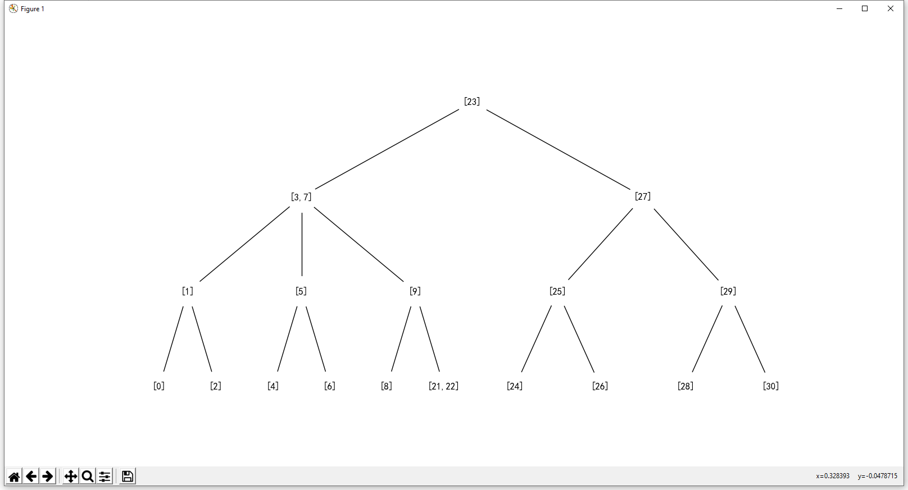
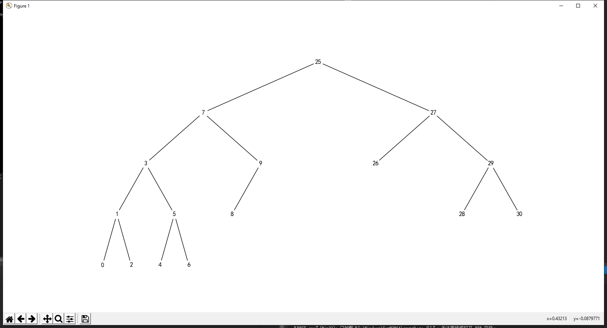

# graphpainter
一个基于python的专画树、二叉树的工具

## 效果图片





## 使用方法
如果您安装了Python,并且已经安装了了networkx库，则可以用以下命令解析图表文件：

```
python graphpainter.py "graph.txt"
```

或者可以增加一个“解码”参数，表示文本编码，默认是GBK，还可以设置为其它python的open支持的encoding，如utf-8：

```
python graphpainter.py "graph.txt" "utf-8"
```

图表文件的格式会在后文介绍。

如果没有安装Python，可以在这个链接下载exe的版本：

链接：https://pan.baidu.com/s/1YdEc7WEvbaMdIEnOPYdSUg 提取码：gz16

解压之后，可以如下调用：

```
graphpainter\graphpainter.exe "graph.txt"
```
## 创建图表文件

一个例子：

```
%Graph%
%joel layout%
%figure%
#figsize#
20,10
%layout%
#root#
0
%draw%
#node_size#
1500
%node%
0:"根节点"
%edge%
0,1
0,2
0,3
%node%
1:"A"
%edge%
1,4
1,5
%node%
2:"B"
%edge%
2,6
2,7
%node%
3:"C"
4:"D"
5:"E"
6:"F"
7:"G"
```

### 第一行：指定图类型
```
%Graph% 无向图
%DiGraph% 有向图
%BT% 二叉树
```
### 第二行：指定使用层次结构
```
%none layout%：随机摆放
%bt layout%：二叉树摆放
%graphviz layout%：调用graphviz运行库（要求电脑安装graphviz并且已经添加到环境路径）
%joel layout%：joel写的树形视图
%joel2 layout%：适合数据很多的joel的树形视图
```
### 数据域
```
%node% 点域
对非二叉树，格式为：
x:"y" x为ID，y为显示的文字，可以省略:“y”部分，则y=str(x)
对二叉树，格式为：
L x:"y" 或 R x:"y"
L表示左节点，R表示右结点
对根节点，可以任选L或R
x为ID，y为显示的文字，可以省略:“y”部分，则y=str(x)
%edge% 边域
a,b
用a,b表示ID为a和ID为b之间的有向（无向）连接。
```
### 可选调参：
```
%figure% 画布设置
#figsize# 画布大小 x*y
10,6
#dpi# 画布分辨率，一个整数数，越大则图越大
80
#edgecolor# 颜色代码，边框颜色
'w'
#facecolor# 颜色代码，背景色
'w'
%layout% 结构图设置
#root# 根节点的编号 （graphviz,joel,joel2,bt可用）
0
#width# 宽度间隔 （joel,joel2,bt可用）
1.
#height# 高度间隔 （joel2可用)
1.
#prog# 输出类型 （graphviz可用)
可以是 'dot', 'twopi', 'fdp', 'sfdp', 'circo'中的一个
%draw% 画图设置
Parameters
    ----------
    G : graph
       A networkx graph

    pos : dictionary, optional
       A dictionary with nodes as keys and positions as values.
       If not specified a spring layout positioning will be computed.
       See :py:mod:`networkx.drawing.layout` for functions that
       compute node positions.

    arrows : bool, optional (default=True)
       For directed graphs, if True draw arrowheads.
       Note: Arrows will be the same color as edges.

    arrowstyle : str, optional (default='-|>')
        For directed graphs, choose the style of the arrowsheads.
        See :py:class: `matplotlib.patches.ArrowStyle` for more
        options.

    arrowsize : int, optional (default=10)
       For directed graphs, choose the size of the arrow head head's length and
       width. See :py:class: `matplotlib.patches.FancyArrowPatch` for attribute
       `mutation_scale` for more info.

    with_labels :  bool, optional (default=True)
       Set to True to draw labels on the nodes.

    ax : Matplotlib Axes object, optional
       Draw the graph in the specified Matplotlib axes.

    nodelist : list, optional (default G.nodes())
       Draw only specified nodes

    edgelist : list, optional (default=G.edges())
       Draw only specified edges

    node_size : scalar or array, optional (default=300)
       Size of nodes.  If an array is specified it must be the
       same length as nodelist.

    node_color : color or array of colors (default='#1f78b4')
       Node color. Can be a single color or a sequence of colors with the same
       length as nodelist. Color can be string, or rgb (or rgba) tuple of
       floats from 0-1. If numeric values are specified they will be
       mapped to colors using the cmap and vmin,vmax parameters. See
       matplotlib.scatter for more details.

    node_shape :  string, optional (default='o')
       The shape of the node.  Specification is as matplotlib.scatter
       marker, one of 'so^>v<dph8'.

    alpha : float, optional (default=None)
       The node and edge transparency

    cmap : Matplotlib colormap, optional (default=None)
       Colormap for mapping intensities of nodes

    vmin,vmax : float, optional (default=None)
       Minimum and maximum for node colormap scaling

    linewidths : [None | scalar | sequence]
       Line width of symbol border (default =1.0)

    width : float, optional (default=1.0)
       Line width of edges

    edge_color : color or array of colors (default='k')
       Edge color. Can be a single color or a sequence of colors with the same
       length as edgelist. Color can be string, or rgb (or rgba) tuple of
       floats from 0-1. If numeric values are specified they will be
       mapped to colors using the edge_cmap and edge_vmin,edge_vmax parameters.

    edge_cmap : Matplotlib colormap, optional (default=None)
       Colormap for mapping intensities of edges

    edge_vmin,edge_vmax : floats, optional (default=None)
       Minimum and maximum for edge colormap scaling

    style : string, optional (default='solid')
       Edge line style (solid|dashed|dotted,dashdot)

    labels : dictionary, optional (default=None)
       Node labels in a dictionary keyed by node of text labels

    font_size : int, optional (default=12)
       Font size for text labels

    font_color : string, optional (default='k' black)
       Font color string

    font_weight : string, optional (default='normal')
       Font weight

    font_family : string, optional (default='sans-serif')
       Font family

    label : string, optional
        Label for graph legend
```

## C++ Graphpainter库
使用C++对graphpainter进行封装，可以调用graphpainter.h来方便地创建一个图表文件。

首先，创建一个`graphpainter`类，其构造函数的参数为调用的程序，默认为`python graphpainter.py`，使用exe调用则需要手动修改exe文件地址。
```cpp
graphpainter GP;
```
其次，创建一个新的图表函数，使用`newpainter`成员函数。

第一个参数filename为图表文件的名称，

第二个参数为一个`GraphType`类型，可以取`Graph`（无向图）、`DiGraph`（有向图）、`BT`（二叉树）三种值；

第三个参数为一个`LayoutType`类型，为使用的布局样式，默认为`auto_`，注意这会在非BT图中使用graphviz，如果电脑没有安装graphviz，可以手动改为`joel`。

```cpp
GP.newpainter("graph.txt",Graph,joel);
```

接下来，可以使用一系列set函数族对可选参数进行设置，具体使用方法参考上文图表文件的格式。一般而言，layout中的根节点root需要手动设置。
```cpp
void setgraph(const char* attr, const char* value); //对应%graph%的设置
void setfigure(const char *attr, const char* value); //对应%figure%的设置
void setlayout(const char *attr, const char* value); //对应%layout%的设置
void setdraw(const char *attr, const char* value); //对应%draw%的设置
```

注意：value是一个字符串类型，但如果本身需要传一个字符串类型的参数，则需要用双引号或单引号把传递的参数括起来以便于python识别，如：
```cpp
GP.setdraw("node_color","\'w\'");
```

然后，可以使用`setnode`来创建一个结点。

第一个参数`nodeid`为一个字符串类型，为该结点的名称；

第二个参数`label`为该结点的标签，默认显示的标签为结点名称。

```cpp
GP.setnode("0","\"根节点\"");
```

如果对于二叉树类型的图`BT`，则需要使用`setbtnode`函数来创建一个二叉结点。

第一个参数`bind`为一个char类型，它只能是L或者R，表示是左孩子或者右孩子。对于根节点，可以任意选择其一。

第二个参数和第三个参数同`setnode`。

```cpp
GP.setbtnode('L',"1","\"结点1\");
```
接下来用`setedge`来设置一条边。

参数1为`uid`，参数2为`vid`，均为字符串类型，表示在ID为uid,vid的点之间连边。

```cpp
GP.setedge("0","1");
```

最后，使用`draw`函数画图。

参数`tip`为等待程序打开时显示的提示文字，默认为"Drawing...\n"

画图结束后，用`close`函数关闭文件句柄。

```cpp
GP.draw();
GP.close();
```

一段完整调用的程序如下：（采用exe形式打开）
```cpp
#include "graphpainter.h"
int main()
{
    graphpainter GP("graphpainter\\graphpainter.exe");
    GP.newpainter("graph.txt", BT);
    GP.setfigure("figsize","16,8");
    GP.setlayout("root", "0");
    GP.setdraw("node_size", "5000");
    GP.setdraw("node_color", "\'b\'");
    GP.setbtnode('L',"0", "\"毛泽东\"");
    GP.setbtnode('L',"1", "\"周恩来\"");
    GP.setbtnode('L',"2", "\"邓小平\"");
    GP.setbtnode('R',"3", "\"彭德怀\"");
    GP.setbtnode('R',"4", "\"习近平\"");
    GP.setedge("1", "2");
    GP.setedge("0", "3");
    GP.setedge("0", "1");
    GP.setedge("2", "4");
    GP.draw();
    GP.close();
    return 0;
}
```
